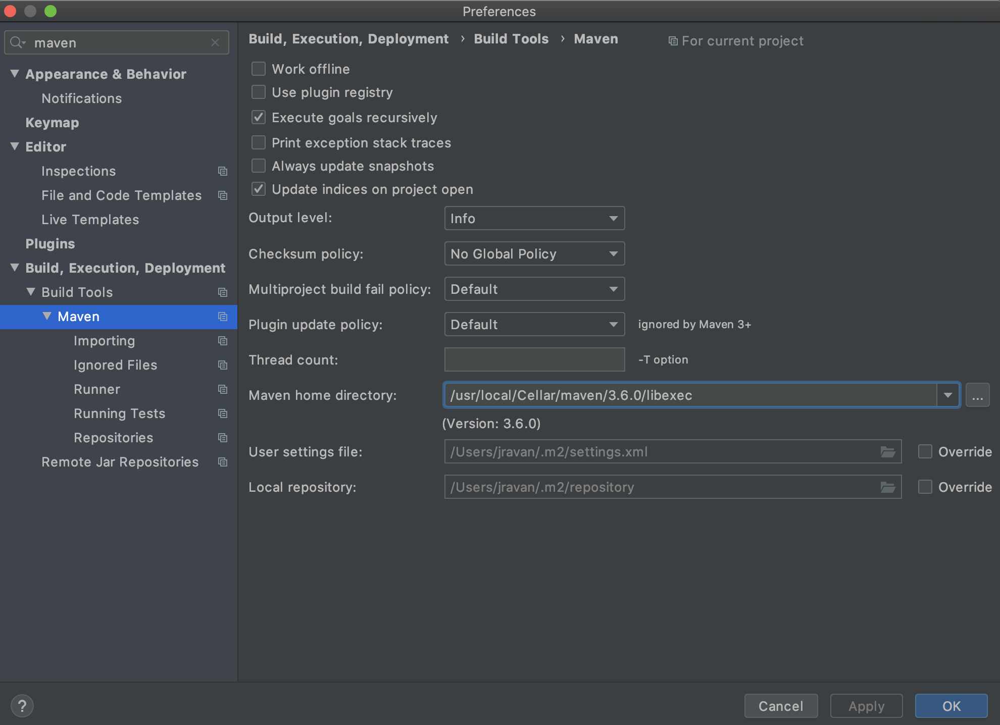
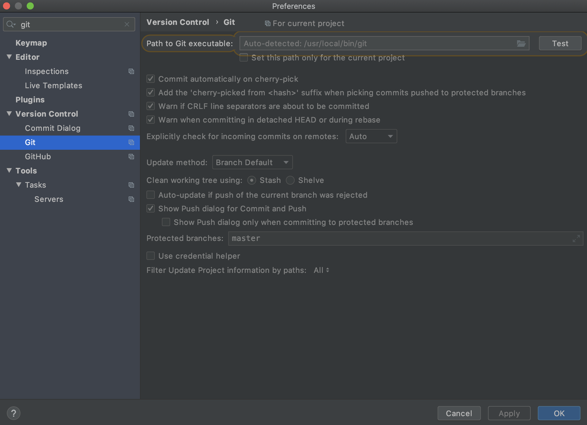
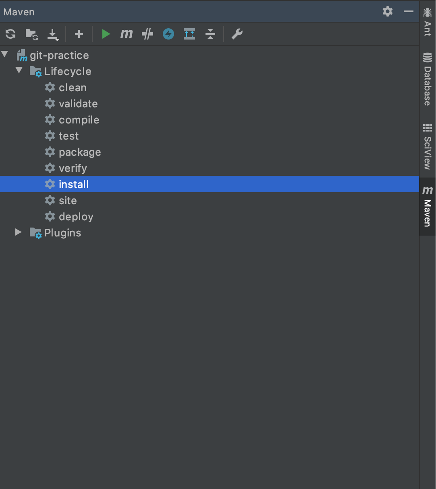
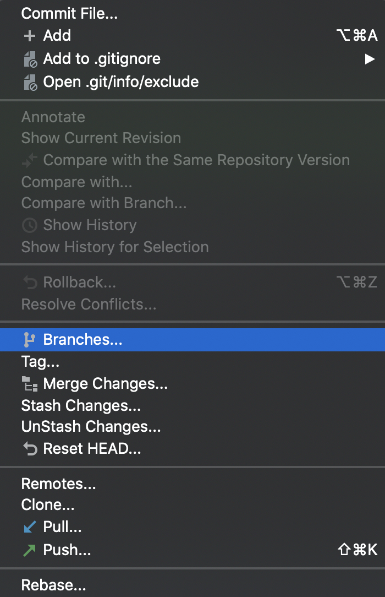
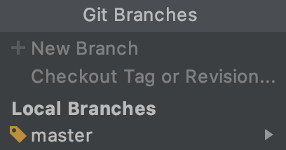
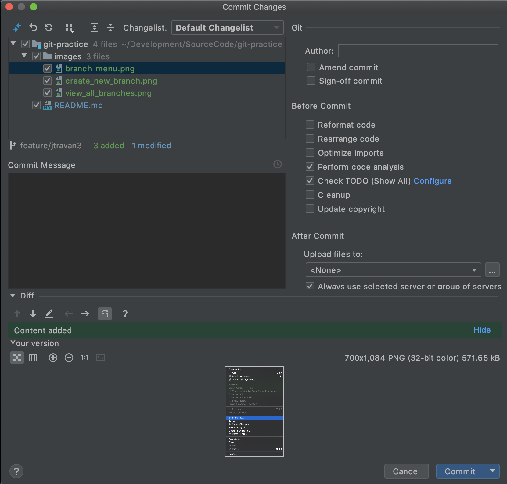
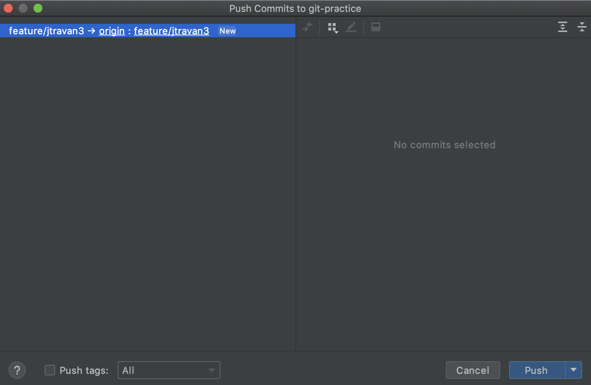

# The best way to 'git' something is by practice!


## Overview

This repository contains the needed base code and instructions for someone who is interested in learning or improving their `git` and Github skills. 

## Usage

This repository is designed so that anyone who is wanting to learn git or practice their git skills can do the following:

1. Clone the repository to their local machine
2. Make changes to files in the repository
3. Commit those changes to a new branch named `feature/{githubUsername}`
4. Push the branch to the repository
5. Open a pull request on [Github](https://github.com/CitadelCS/git-practice)

## IDE (IntelliJ)

I use the IDE IntelliJ for all coding examples. You can use any IDE that you choose (Eclipse, Netbeans, VS Code, etc.) however,
I will only be able provide assistance for IntelliJ.

IntelliJ is quite expensive however students/instructors can receive a free license by filling out an application with their
school email address. Simply go to [https://www.jetbrains.com/student/](https://www.jetbrains.com/student/) and fill out an
application in order to receive your free license.

## Git Practice

If you're interested in getting started with `git`, follow the instructions below to help you understand the process.

### Git Command Line

1.) First you will need the `git` command line tools. Download `git` located at [https://git-scm.com/](https://git-scm.com/) 
or if you have a Mac you can use `brew`.

```bash
brew install git
```

2.) Install maven 3.6.0 and Java JDK 11. JDK located at [https://openjdk.java.net/install/](https://openjdk.java.net/install/) or if you have a Mac you can use `brew`. If you don't want to install Maven 
you can use the `./mvnw` wrapper command instead.

```bash
brew install maven
brew install java
```

If you don't have the `brew` capability you'll have to install Maven directly. Navigate to [https://maven.apache.org/download.cgi](https://maven.apache.org/download.cgi)
and download `apache-maven-3.6.3-bin.zip`. After you have downloaded, place in a location on your computer that will not change (e.g. **NOT** your Downloads folder).
Then navigate to [https://maven.apache.org/install.html](https://maven.apache.org/install.html) and follow the instructions.

> Make sure you have a JAVA_HOME environment variable, a MAVEN_HOME environment variable, and both added to your PATH

IntelliJ comes packaged with Maven so you want to make sure that the correct version of maven is being used. I recommend opening `Preferences` and searching
for `Maven`. You should see the following screen. Make sure that the selected `maven` executable is the one installed on your system and not the bundled version.



3.) Now that you have your environment setup you need to create a fork of the repository so that you can add changes. First navigate to [https://github.com/CitadelCS/git-practice](https://github.com/CitadelCS/git-practice)
and click `Fork` in the top-right of the page. This will create a copy of the repository in your Github account. Then clone down the repository from Github

```bash
git clone git@git.github.com:{yourGithubUsername}/git-practice.git
```

4.) Build the project

```bash
./mvnw clean install
```

You should be able to run the `HelloWorld` program successfully if you have everything setup correctly.

5.) Now that you have your environment setup we'll want to make some changes to some files. For this repository you're going to make two changes. One will be a version change in
`pom.xml` and the second will be an entry in `CHANGELOG.md`.

6.) Navigate to `pom.xml` and increase the minor fix version by one. See the before and after example below.

**Before**
```xml
<groupId>edu.citadel</groupId>
<artifactId>git-practice</artifactId>
<version>1.0.1</version>
```

**After**
```xml
<groupId>edu.citadel</groupId>
<artifactId>git-practice</artifactId>
<version>1.0.2</version>
```

7.) Next navigate to `CHANGELOG.md` and add an entry for yourself. See the example below

```markdown
## [1.0.1] - 2019/12/11

### Added

- John Ravan updated the version to 1.0.1
```

8.) After completing the file edits within your repository create a branch for the change

```bash
git checkout -b feature/{githubUsername}
```

9.) Add all of your changed files to the newly created branch

```bash
git add .
```

10.) Commit all of the added files to your branch with a message

```bash
git commit -m "I added myself to the CHANGELOG.md"
```

11.) Now that all of your changes have been commit to the new branch, push the new branch to the remote repository.

```bash
git push origin feature/{githubUsername}
```

12.) Visit the repository through `https://github.com/{yourGithubUsername}/git-practice` and open a pull request for merging your feature branch into
the `master` branch. From here, I'll review the pull request to make sure it looks great and then merge it in. You'll be added to the history of the `CHANGELOG.md`!

### Git GUI (IntelliJ)

1.) While you'll be using IntelliJ for your git GUI, you'll still need the git command line tools so that IntelliJ can leverage them. Download `git` located at [https://git-scm.com/](https://git-scm.com/) 
or if you have a Mac you can use `brew`.

```bash
brew install git
```

2.) Then you will need the IntelliJ IDE located at [https://www.jetbrains.com/idea/](https://www.jetbrains.com/idea/). Download and install.

3.) Once you have both installed you'll need to make sure that IntelliJ has them configured. If you used `brew` then it will probably
be configured automatically. If not you'll need to open `Preferences` and search for `Git`. Then make sure the `git` executable is added correctly



4.) Install maven 3.6.0 and Java JDK 11. JDK located at [https://openjdk.java.net/install/](https://openjdk.java.net/install/). If you have a Mac you can use `brew`.

```bash
brew install maven
brew install java
```

IntelliJ comes packaged with Maven so you want to make sure that the correct version of maven is being used. I recommend opening `Preferences` and searching
for `Maven`. You should see the following screen. Make sure that the selected `maven` executable is the one installed on your system and not the bundled version.


5.) Fork (see instructions above) and clone down the repository from Github. The easiest way is to open an IntelliJ window and select `File -> New -> Project from Version Control`.
Paste the Github URL and IntelliJ does the rest.


6.) Build the project by clicking the Maven window on the far right of your editor. You should see the following image. Click `clean` and then `install` to ensure the project builds successfully.



You should be able to run the `HelloWorld` program successfully if you have everything setup correctly.

7.) Now that you have your environment setup we'll want to make some changes to some files. For this repository you're going to make two changes. One will be a version change in
`pom.xml` and the second will be an entry in `CHANGELOG.md`.

8.) Navigate to `pom.xml` and increase the minor fix version by one. See the before and after example below.

**Before**
```xml
<groupId>edu.citadel</groupId>
<artifactId>git-practice</artifactId>
<version>1.0.1</version>
```

**After**
```xml
<groupId>edu.citadel</groupId>
<artifactId>git-practice</artifactId>
<version>1.0.2</version>
```

9.) Next navigate to `CHANGELOG.md` and add an entry for yourself. See the example below

```markdown
## [1.0.1] - 2019/12/11

### Added

- John Ravan updated the version to 1.0.1
```

10.) After completing the file edits within your repository create a branch for the change.

11.) First open the branches menu by navigating to the top menu `VCS -> Git -> Branches`



12.) Then open to view all available branches so that you can create a new one



13.) Create a new branch with your Github username


14.) Add all of your changed files to the newly created branch by navigating to `VCS -> Commit`



15.) Simply add a commit message and click `Commit` at the bottom right.

16.) Now that all of your changes have been commit to the new branch, push the new branch to the remote repository. Navigate to `VCS -> Git -> Push` to find the push dialog



17.) Visit the repository through [Github](https://github.com/jtravan3/git-practice) and open a pull request for merging your feature branch into
the `master` branch. From here, I'll review the pull request to make sure it looks great and then merge it in. You'll be added to the history of the `CHANGELOG.md`!

## LICENSE

GNU General Public License v3.0, see [LICENSE](https://github.com/jtravan3/git-practice/blob/master/LICENSE) for details.

## Resources

List of resources to help with learning git and IntelliJ

### Git/Github

* [Pro Git](https://git-scm.com/book/en/v2)
* [Github Git Cheatsheet](https://github.github.com/training-kit/downloads/github-git-cheat-sheet.pdf)
* [Roger Dudler Git Guide](https://rogerdudler.github.io/git-guide/)
* [try.github.io](https://try.github.io/)

### IntelliJ

* [IntelliJ IDEA](https://www.jetbrains.com/idea/)
* [IntelliJ Tutorials](https://www.jetbrains.com/idea/documentation/)
* [IntelliJ IDE Features Trainer Plugin](https://blog.jetbrains.com/idea/2016/12/ide-features-trainer/)
* [Jetbrains Academy](https://www.jetbrains.com/academy/)
